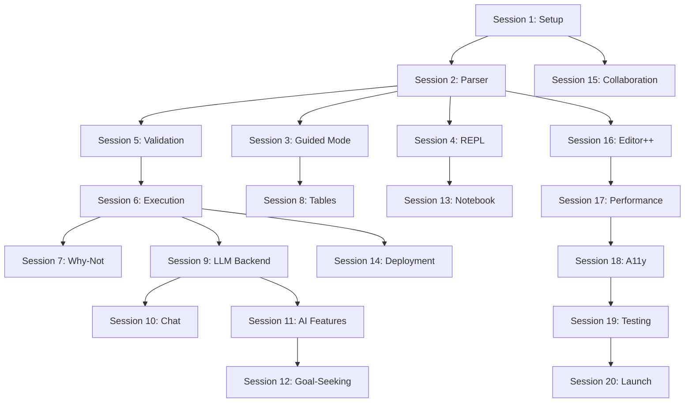

# RegelSpraak Web UI - Implementation Sessions Overview

This document provides an overview of all implementation sessions for the RegelSpraak Web UI. Each session is designed to be completed in 4-8 hours and builds upon previous sessions.

**Total Timeline**: 10 weeks (2 sessions per week)
**Target Directory**: `/home/yeb/regelspraak-parser/frontend`

## Phase 1: Core Editor & REPL (Weeks 1-2)

### Session 1: Project Setup & Monaco Editor ✓
**File**: `PLAN_TS_UI_session_1.md`
- React + TypeScript + Vite setup
- Monaco Editor integration  
- RegelSpraak syntax highlighting
- Basic project structure

### Session 2: TypeScript Parser Integration ✓
**File**: `PLAN_TS_UI_session_2.md`
- Web Worker for parsing
- Real-time error decorations
- AST Explorer panel
- Performance optimizations

### Session 3: Guided Mode Interface ✓
**File**: `PLAN_TS_UI_session_3.md`
- Dual-mode editor (Expert/Guided)
- Rule builder form
- Object type builder
- Template library

### Session 4: REPL Implementation
**File**: `PLAN_TS_UI_session_4.md`
- Interactive console component
- Command processing
- Context management
- Python interop compatibility

## Phase 2: Validation & Execution (Weeks 3-4)

### Session 5: Validation Panel
**File**: `PLAN_TS_UI_session_5.md`
- Error list with navigation
- Quick fix integration
- Warning system
- Performance monitoring

### Session 6: Execution Playground
**File**: `PLAN_TS_UI_session_6.md`
- Test data editor
- Execution engine integration
- Result visualization
- Trace explorer

### Session 7: Why-Not Analyzer
**File**: `PLAN_TS_UI_session_7.md`
- Failed condition analysis
- Visual trace with branches
- Quick fixes for conditions
- Goal-seeking UI basics

### Session 8: Decision Table Editor
**File**: `PLAN_TS_UI_session_8.md`
- Visual table editor
- Drag-and-drop columns
- Cell validation
- Import/export CSV

## Phase 3: AI Integration (Weeks 5-6)

### Session 9: LLM Backend Setup
**File**: `PLAN_TS_UI_session_9.md`
- FastAPI backend service
- LLM integration (OpenAI/Claude)
- Prompt engineering
- API endpoints

### Session 10: AI Chat Interface
**File**: `PLAN_TS_UI_session_10.md`
- Chat UI component
- Natural language queries
- Code suggestions
- Explainability integration

### Session 11: AI-Powered Features
**File**: `PLAN_TS_UI_session_11.md`
- Rule generation from description
- Test case generation
- Code optimization suggestions
- Dutch language support

### Session 12: Goal-Seeking Advanced
**File**: `PLAN_TS_UI_session_12.md`
- Outcome designer UI
- Change suggestion engine
- What-if scenarios
- Interactive exploration

## Phase 4: Notebook & Deployment (Weeks 7-8)

### Session 13: Notebook Interface
**File**: `PLAN_TS_UI_session_13.md`
- Cell-based editor
- Markdown support
- Persistent kernel state
- Export to various formats

### Session 14: API Deployment
**File**: `PLAN_TS_UI_session_14.md`
- OpenAPI generation
- Deployment workflow UI
- Endpoint preview
- Version management

### Session 15: Collaboration Features
**File**: `PLAN_TS_UI_session_15.md`
- WebRTC setup
- CRDT implementation
- Cursor awareness
- Conflict resolution

### Session 16: Advanced Editor Features
**File**: `PLAN_TS_UI_session_16.md`
- Auto-completion provider
- Snippet management
- Refactoring tools
- Multi-file support

## Phase 5: Polish & Testing (Weeks 9-10)

### Session 17: Performance Optimization
**File**: `PLAN_TS_UI_session_17.md`
- Bundle optimization
- Lazy loading
- Virtual scrolling
- Memory profiling

### Session 18: Accessibility & Mobile
**File**: `PLAN_TS_UI_session_18.md`
- WCAG AA compliance
- Keyboard navigation
- Screen reader support
- Tablet optimization

### Session 19: Testing & Documentation
**File**: `PLAN_TS_UI_session_19.md`
- Unit test setup
- Integration tests
- E2E with Playwright
- User documentation

### Session 20: Final Integration
**File**: `PLAN_TS_UI_session_20.md`
- Production build setup
- Deployment configuration
- Performance benchmarks
- Launch preparation

## Key Architectural Decisions

Following Carmack's principles throughout:

1. **Direct Manipulation**: Always show the RegelSpraak code
2. **Immediate Feedback**: <50ms parse time target
3. **No Magic**: Transparent AI suggestions with explanations
4. **Performance First**: Web Workers, virtual scrolling, lazy loading
5. **Progressive Enhancement**: Works without AI, better with it

## Success Metrics

- **Parse Performance**: <50ms for 1000 lines
- **Bundle Size**: <500KB gzipped
- **Lighthouse Score**: >95
- **Test Coverage**: >80%
- **Time to First Rule**: <5 minutes for beginners

## Dependencies Between Sessions

## Getting Started

1. Complete sessions in order within each phase
2. Sessions within a phase can sometimes be done in parallel
3. Each session includes verification steps
4. Keep the main vision document (`PLAN_TS_UI_v1.md`) handy
5. Commit working code after each session

The modular approach ensures that even if not all sessions are completed, you'll have a working product at each phase boundary.